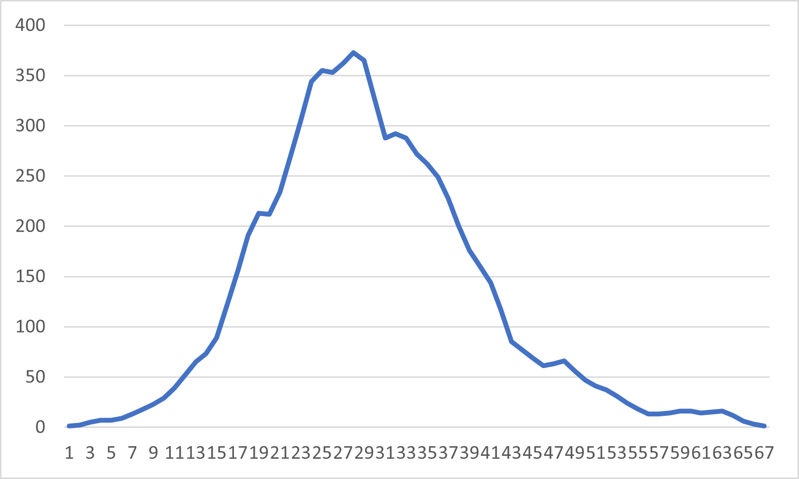

# Lattice Shell Search

## Input
An ASCII file containing a list of simplices and their neighbors. Each line will take the following form:
```
simplex_id  neighbor_1 neighbor_2 neighbor_3 ...
```

## Output
Prints a number of simplices in each 'shell'

## Usage
### Compiling
```
g++ shell_search.cpp -o search_executable.out
```
### Running
```
./search_executable.out input_filename starting_simplex_id
```

For example, to run this with the file 'N4lattice' starting with the 0 simplex:
```
./search_executable.out N4lattice 0
```

To output this to a .csv file for quick plotting with Excel:
```
./search_executable.out N4lattice 0 >> shell_sizes.csv
```

## Example plot of results
